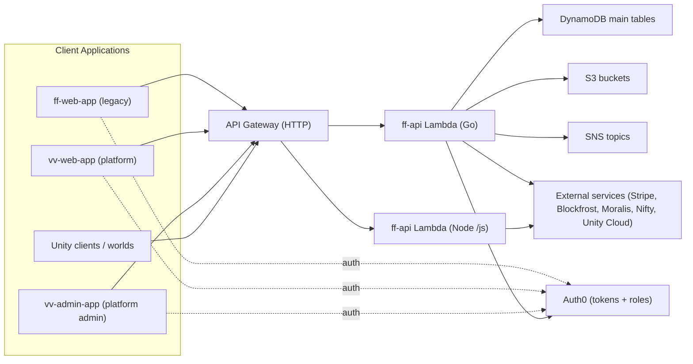

# Architecture

This document maps the current multi-repo system and its transition from
FutureFest-specific product to a general VirtualVenues platform.

Last verified against workspace code on **2026-02-13**.

## Product Direction

- **Then**: FutureFest app stack (`ff-web-app` + `ff-api` + infra).
- **Now**: shared platform direction (`vv-web-app` + `vv-admin-app` + `ff-api`).
- **Target**: FutureFest becomes tenant/data inside VirtualVenues; `ff-web-app`
  is legacy and expected to be deprecated over time.
- **Realtime transition**: legacy EC2 socket services (`world-socket`,
  `stage-socket`) are still wired in parts of the backend; intended direction is
  serverless WebSocket infrastructure (API Gateway/Lambda).

## Repository Map

| Repository | Role | Status | Source Control | Main Dependencies |
|------------|------|--------|----------------|-------------------|
| `VirtualVenuesHome` | Shared docs, standards, onboarding/bootstrap | Active | GitHub | None (reference repo) |
| `ff-api` | Core backend API (legacy + VV routes) | Active, shared | GitHub + GitLab remote present | AWS API Gateway/Lambda, DynamoDB, S3, SNS, Auth0, Stripe, Unity Cloud, external APIs |
| `ff-infrastructure` | Terraform stacks/modules for API/Auth0/web hosting | Active | GitHub | AWS, Auth0, Terraform |
| `ff-web-app` | Legacy FutureFest frontend | Legacy, still operational | GitHub + GitLab remote present | `ff-api`, Auth0 |
| `vv-web-app` | VirtualVenues user-facing frontend | Active, strategic | GitHub | `ff-api` (`/vv/*` + server routes), Auth0 |
| `vv-admin-app` | VirtualVenues admin/ops frontend | Active, strategic | GitHub | `ff-api` (`/admin/*` + server routes), Auth0 |
| `world-socket` | Legacy realtime world/customization socket service | Transitional/legacy | GitHub | Socket.IO clients, FF server lifecycle |
| `stage-socket` | Legacy stage/Twitch interaction socket service | Transitional/legacy | GitHub | Twitch APIs, Socket.IO clients |
| `FutureFestXR` | Unity project workspace | Active content/client | Unity Version Control (UVCS) | Unity Cloud / FF platform services |
| `FutureFestWorlds` | Unity world assets workspace | Active content/client | UVCS | Unity toolchain |
| `VirtualVenuesWorldCreator` | Unity world creator workspace | Active tooling | UVCS | Unity toolchain |

## Runtime Topology (Current)

## Game Server / Realtime Path (Current)

`vv-web-app` and admin flows currently reuse legacy server orchestration:

1. Client calls `POST /vv/events/{eventId}/servers` (or `/events/{eventId}/game-servers`).
2. `ff-api` starts **world socket EC2** first.
3. `ff-api` starts **game server EC2** and stores instance metadata.
4. `ff-api` updates Route53 event record(s) and user/server binding records.
5. Clients use server connection data (`/events/{eventId}/available-servers`,
   `/join-server`) and socket endpoints.

Legacy realtime dependencies still visible in backend entities/flows:

- `socket_server_api_url`
- `world_socket_instance_id`
- `world_socket_ip`
- `stage_socket_server_url`

## API Surface by Consumer

| Consumer | Primary Route Families |
|----------|------------------------|
| `ff-web-app` | Legacy routes (`/active-events`, `/customize-*`, `/shop-*`, `/events/{eventId}/available-servers`, `/join-server`, `/leave-server`) |
| `vv-web-app` | Platform routes (`/vv/profile`, `/vv/events*`, `/vv/worlds*`, `/vv/catalogs`, `/vv/usage`, `/vv/host-settings`, `/vv/venue/*`, `/vv/subscription/*`), plus shared server routes |
| `vv-admin-app` | Admin routes (`/admin/events*`, `/admin/worlds*`, `/admin/catalogs*`, `/admin/webgpubuilds*`, `/admin/users/*`, `/admin/logs`, `/admin/ec2-logs`), plus shared server routes |
| Unity/UPC/UMS | `/upc/*`, `/ums/*`, `/current-server`, `/multi/user/info`, `/events/{eventId}/host-settings` |

## Data Boundaries (Current Shared Model)

Core logical groups in backend data model:

- Identity and account: users, wallets, usernames, roles, tiers.
- Event runtime: events, stages, servers, game server instances, room/chat state.
- Content: worlds, catalogs (avatar collections), webgpu builds, defaults.
- Platform business layer: usage metering, subscription/billing linkage, host settings.
- Legacy FF commerce/collectibles: shop, NFTs, purchased items, action/cosmetic customization.

Important architectural property: FF and VV currently share the same backend and
data domain, with VV implemented mostly as route/behavior layering in `ff-api`.

## Environment Map

| Environment | API/Auth Pattern | Web Domain Pattern | Notes |
|-------------|------------------|--------------------|-------|
| `prod` | `login.futurefest.io` + `https://multiauth.futurefest.io` | `beam.futurefest.io` | Legacy production baseline |
| `fractal-testing` | Auth0 testing tenant + testing audience | `fractal-testing.futurefest.io` (+ some VV domains in CORS) | Active testing stack |
| `microscope-dev` | Dev tenant + localhost-style audience | localhost + dev domains | Legacy dev stack |
| `aurora-dev` | Dedicated tenant + `https://api.aurora-dev.futurefest.io` | `aurora-dev.futurefest.io` | Newer stack with explicit web-hosting module and Terraform workflow |

## Current vs Target Realtime Architecture

### Current

- EC2-hosted `world-socket` and `stage-socket` (Socket.IO based).
- API holds orchestration responsibility for socket + game server lifecycle.
- Realtime URLs and socket server fields are persisted in event/server entities.

### Target

- API Gateway WebSocket + Lambda managed path for realtime messaging.
- Remove coupling to dedicated socket EC2 instances.
- Simplify server start/stop flow and reduce custom EC2 management in API.
- Phase out `world-socket` / `stage-socket` repos once replacement is complete.

## Coupling/Transition Risks To Track

- `ff-web-app` is still wired to live backend surfaces while platform migration is underway.
- `ff-web-app` and `ff-api` each still show dual remote history (GitHub + GitLab).
- Infra docs still partially describe pre-`aurora-dev` environment set.
- Legacy socket fields/endpoints remain in active backend paths, so migration must
  be done as staged compatibility work, not a hard cut.
- Unity workspaces are present but do not yet include local architecture docs
  mapping their runtime dependencies in this workspace.
